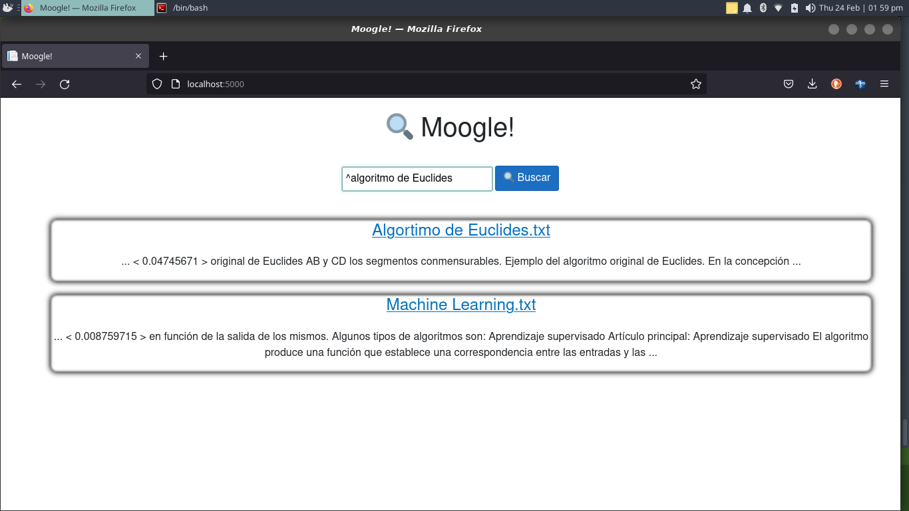
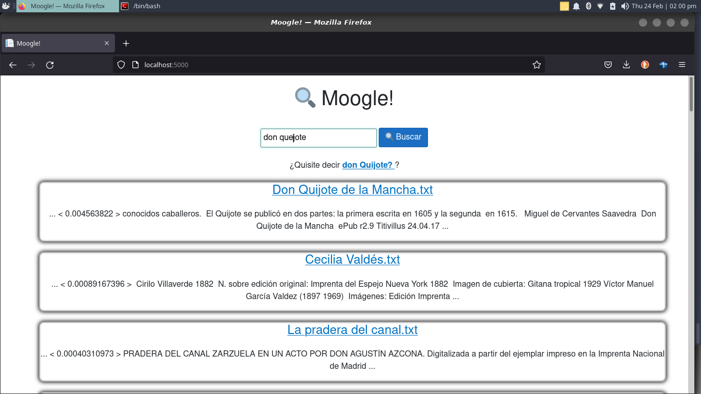
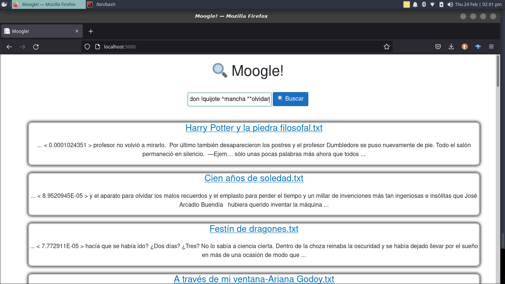
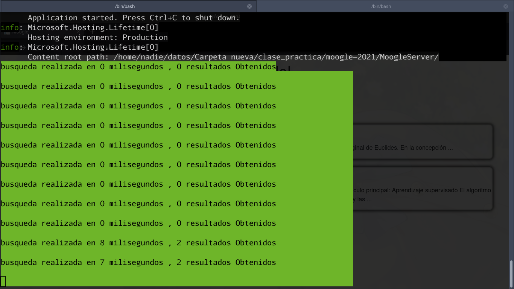
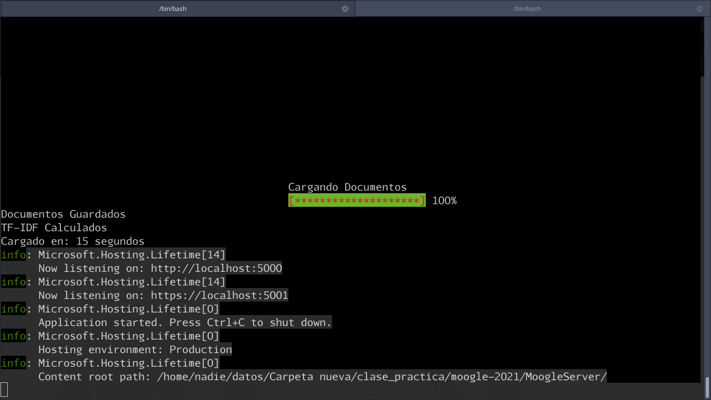

# Moogle!


> Proyecto de Programación I. Facultad de Matemática y Computación. Universidad de La Habana. Curso 2021.

Moogle es un buscador de Documentos , desarrollado en el lenguaje de programacion c# , utilizando lo aprendido en el curso de programacion de la carrera Ciencias de la Computación 2021

## Como se estructura el Proyecto?
- `MoogleServer` es un servidor web que renderiza la interfaz gráfica y sirve los resultados.
- `MoogleEngine` es una biblioteca de clases donde esta la logica asociada a la busqueda
- `TextRepresentation` es una libreria de clases donde se encuentra la logica asociada al almacenamiento del texto 
- `TextTretment` como su nombre indica esta libreria de clases contiene la logica asociada al tratamiento del texto
- `SearchEngine` libreria de clases asociada a procesar las busquedas 


 ## Sobre la búsqueda
La busqueda se realiza introduciendo una frase o palabra a buscar en el campo de texto de la pagina principal de moogle .Para realizar las busquedas he utilizado `el modelo vectorial` de recuperacion de la informacion el cual consiste en crear un espacio vectorial donde cada dimension corresponde a un termino del `corpus` textual , midiendo la relevancia de cada `termino` en dicho corpus , con esto ya creado se puede trarar cada documento como un vector n-dimensional , un proceso parecido se le aplica a la busqueda , para luego , aplicando una medida de similitud entre estos vectores , encontrar aquellos documentos que son relevantes respecto a la busqueda.
 - En general un usuario puede buscar no solo una palabra sino una frase cualquiera
 - Los Documentos devueltos no tiene que tener todas las palabras , pero su `score` disminuye mientras menos palabras tenga
 - Si dos documentos tienen el mismo score pero uno tiene una palabra mas 'importante' que otra (mas rara) , este es devuelto con un score mayor
 - Las palabras demasiado comunes como las preposiciones conjunciones etc son ignoradas y no aportan relevancia al score del documento


 ### Operadores de búsqueda
Para Obtener mejores resultados , moogle cuenta con una serie de operadores que facilitan la obtencion de informacion
`!` filtra los documentos para obtener solo aquellos que **no tengan la palabra que sigue** al operador
`^` permite obtener solo documentos que cumplan con la condicion de **tener la palabra seguida por el operador**
`~` aumenta el `score` o relevancia de un documento , mientras **mas cercanas** esten las palabras a sus laterales dentro del documento
`*` son acumulativos y aumentan la relevancia de un termino en especifico 

###Evaluacion del Score
Para evaluar el `Score` utilizo el **TF-IDF** apoyado por el **modelo vectorial** de recuperacion de la informacion
Sabiendo cuantas veces se repite una palabra dentro del documento ( Frequency Term o TF) puedo saber su relevancia dentro de ese documento , luego 
teniendo calculadas las frecuencias de termino (TF) en todos los terminos de los documentos que forman el corpus textual calculo el IDF o frecuencia inversa
para determinar la relevancia de cada termino en el corpus general , con todo esto armo un vocabulario que contiene todas las palabras de los documentos
y convierto estos a vectores de R*n* donde n es la cantidad de terminos entre los documentos , Haciendo este mismo proceso a la Query o consulta del usuario
obtengo 2 vectores de Rn (el de Query y el de el Documento i-esimo) a los cuales se les puede hallar la distancia coseno que me permite determinar el Coseno del Angulo entre dos Vectores del mismo espacio , mientras mayor es el valor obtenido de la distancia coseno , menor es el angulo entre dichos vectores en su espacio 
,por tanto estan mas cerca y el Query es mas relevante a la busqueda


# Ingenieria de Software
Para mantener mi proyecto lo mas encapsulado y facil de mantener posible , abstraje la logica de cada componente en distintas clases y distintos `classlibrary`
para mantener un orden en el proyecto
 ##ClassLibrarys:
 - `Algetool` : Contiene la logica asociada a los calculos algbraicos necesarios como calcular la norma de un vector Hallar la distancia coseno entre dos vectores
 - `TextRepresentation`: Contiene la logica asociada a la representacion de los textos y su almacenamieto correcto para ser utilizados en el buscador
 - `TextTreatment`: abstrae de la logica de procesar y tratar los textos 
 - `SearchEngine`: Contiene la logica necesara para hacer la busqueda y depende de el resto de class librarys

# Clases creadas por mi:
## Cada clase se usa para abstraer de una logica distinta que al final se unen para hacer funcionar el proyecto
- ### clase TextRepresentation/WordInfo
    - **clase para almacenar metadatos de los terminos** 
    ```cs
        public class WordInfo
        {        
           public WordInfo(string originalWord ,int fila)//constrictor , inicializa las listas y annade un dato a ellas  

           public int[] GetPositions()//devuelve las posiciones del termino
    
            public string[] OriginalTerms()//devuelve las palabras originales    

    		public void AddPos(string originalWord,int position)//agrega una posicion del termino y su palabra original

      		public int GetFrequency()//devuelve la frecuencia del termino representado    
     	}

    ```
- ### clase TextRepresentation/BaseText
    - **abstrae la logica de leer y procesar texto** 
     ```cs
        public class BaseText 
        {	
	    protected BaseText() //constructor basico , inicializa las propiedades

	    protected BaseText(string text):this()//constructor que recibe el texto , llama al constructor basico y llena los campos de la clase	

	    public int WordCount()//retorna la cantidad de palabras asociadas al texto procesado	

	    protected void FillTerms(string text)//Funcion para rellenar los terminos en el documento	


	    protected string[] GetTokens(string text)//retorna los tokens del texto (un array con sus palabras)	
	    private string ReduceText(string text)//elimina caracteres innecesarios	

	    public IEnumerable<string> GetTerms()//retorna los terminos 

	    public WordInfo GetTerm(string term)//permite obtener los metadatos de un termino especifico	
        public virtual  int GetTermFrequency(string term)

	    protected int GetFrequency(string term)//metodo para obtener la frecuencia de un termino 	
       }
    ```

- ### clase TextRepresentation/Document
    - **abstrae la logica propia de cada documento y guarda datos relevantes como su titulo ruta etc** 
     ```cs
	public class Document:BaseText		     
	{	
	public Document(string path):base()//constructor de la clase guarda datos de interes nombre del documento , ruta ,etc; y procesa el texto leido con los metodos heredados


  	public string Name{get{return name;}}//propiedades para obtener el nombre	
	public string Route{get{return path;}}//propiedad para obtener la ruta del documento

	public string Snippet(IEnumerable<string> terms)//metodo para 

	public int GetMinDistance(string term,string term2)//dadas dos palabras , clacula la distancia minima entre ellas
	

	public bool ContainsWord(string word)//retorna true si el documento contiene la palabra  false en caso contrario

	private int CalculateMinDistance(int[] positions1,int[] positions2)//calcula la distacia entre los array de posiciones de dos palabras	
      }

	```
- ### clase TextRepresentation/Query
    - **define la logica asociada a la consulta hecha por el usuario como procesar los operadores etc** 
	```cs
	public class Query:BaseText		   
	{
	
	public Query(string text):base()//Constructor de la clase			

    public IEnumerable<string> GetOperatorList()//obtiene los operadores del query 
		
	public IEnumerable<string> GetOperatorWords(string Operator)//retorna un iterador que apunta a las palabras asociadas a cada operador

	public override int GetTermFrequency(string term) //metodo para obtener la frecuencia y variarla en funcion del operador *

	private string RemoveOperators(string text)//elimina los operadores de la consulta original	y los almacena con sus respectivas listas de palabras afectadas
	
	private void ProcessOperator(string text,char op,ref int position)//procesa cada operador de manera individual										
	
    }

	```
- ### clase TextTreatment/Stemmer
  - **Implementacion sencilla del algoritmo de porter para la reduccion de palabras a sus raices comunes**
	```cs
	public static class Stemmer 
	{
		  public static string Stemize(string word) //devuelve el Stem o raiz comun de una palabra
	}
	``` 
- ### clase TextTreatment/TextProcessor
  - **procesador de textos para eliminar caracteres invalidos procesar numeros etc**
	```cs
	public static class TextProcessor
      {

	   public static IEnumerable<string> ProcessWords(string[] words)//devuelve un iterable de las palabras procesadas 	

	   public static string ProcessWord(string word)//dada una palabra cualquiera devuelve la palabra procesada	

	  public static int DistanceBetweenWords(string word1,string word2)//usando el algoritmo de levensgtein devuelve la medida de igualdad entre dos palabras	

	  private static string Normalize(string original)//lleva la palabra a minusculas y cambia las tildes y caracteres especificos del espannol

	  private static string RemoveSigns(string wrd)//elimina los simbolos raros y todo lo que no sea una letra
	

	  private static string ProcessNumbers(string word)//procesa los numeros fechas horas etc

     }
	```
- ### clase SearchEngine/Vocabullary
 - **Donde ocurre la magia, clase que procesa el corpus textual y asigna pesos a los terminos de cada documento**
     ```cs
	  public class Vocabullary
      {		   
	   public Vocabullary(Document[] documents)//constructor de la clase almacena los documentos 

	  public IEnumerable<Document> GetSearchSpace(Query query)//reduce el espacio de busqueda de la consulta y filtra los documentos por los operadores ^ y !
	
	  public Vector GetDocVector(string name)//obtiene el vector numerico del documento especificado

	  public Vector VectorizeDoc(BaseText text)//devuelve un vector numerico n-dimencional donde n es la cantidad de terminos del vocabulario y en cada componente almacena el valor TF-IDF  de cada termino 

     }
    ```
- ### clase SearchEngine/Searcher
  - **En esta clase se unen todos los componentes para realizar la busqueda y devolver el peso asociado a cada documento relacionado con la consulta**
    ```cs
	 public class Searcher
     {
	  public static Searcher GetSingleInstance()//funcion para obtener una instancia de la clase 

	    private Searcher()//constructor del objeto

	   public IEnumerable<(string,string,float)> Search(ref string query)//Realiza la busqueda y en caso de haber errores en la consulta los repara	
      } 
     ```
- ### clase Algetool/Vector
  - **Representacion de un vector matematico que contiene sus operaciones y propiedades**
    ```cs
	 public class Vector
     {
	  public Vector(float[] vector)//constructor

	  public static float CosDistance(Vector vec1, Vector vec2)//Calcular el coseno del angulo entre dos vectores

      private static Vector ScalarProduct(Vector v1, float scalar)//producto de un vector por un escalar

      private static float DotProduct(Vector vec1,Vector vect2)//producto punto entre vectores
      }

     ```


# Flujo de Funcionamiento
#### Al iniciar el servidor , este crea una instancia de Searcher el cual carga los Documentos  y los procesa individualmente para obtener los datos relevantes sobre ellos , tales como su nombre, ruta y frecuencia de sus terminos , estos luego son utilizados para crear un vocabulario o `"bag of words"` que contiene todos los terminos del corpus textual (los documentos)  , con esto hecho se vectorizan los documentos calculando para cada termino su frecuencia inversa o IDF y se utiliza esta metrica para normalizar la frecuencia del termino en el documento (TF) y asi definir la relevancia de cada termino en el documento , estos vectores son almacenados para utilizarse en las busquedas .

#### Cuando un usuario realiza una consulta en la interfaz grafica esta pasa al servidor donde se Procesan los datos introducidos por el usuario tales como separar los operadores procesar los terminos y calcular a cada uno de ellos sus frecuencias utilizando el vocabulario , una vez hecho esto se procede a reducir el espacio de busqueda seleccionando los documentos que cumplan con los operadores `*` y `!` luego utilizando los vectores de los documentos previamente calculados y el de la consulta se procede a hacer el calculo de la relevancia o score de cada documento respecto al query , esto se cubre utilizndo la distancia coseno entre vectores la cual es una medida de similitud entre vectores , este score se afecta en dependencia de los operadores `*` y `~` , luego de calcular todos los scores , se organiza la lista de documentos segun su score de mayor a menor y se devuelven al usuario , si hubo alguna palabra que no se pudo encontrar utilizando el algoritmo de Levengstein trato de encontrar alguna palabra que arregle la consulta


# Ejemplo del proyecto en funcionamiento

## ejemplo operador "^"

## ejemplo de la obtencion de una sugestion

## ejemplo de una busqueda utilizando operadores


## Mostrando resultados y velocidad de la busqueda


## Pantalla de carga al iniciar el servidor

